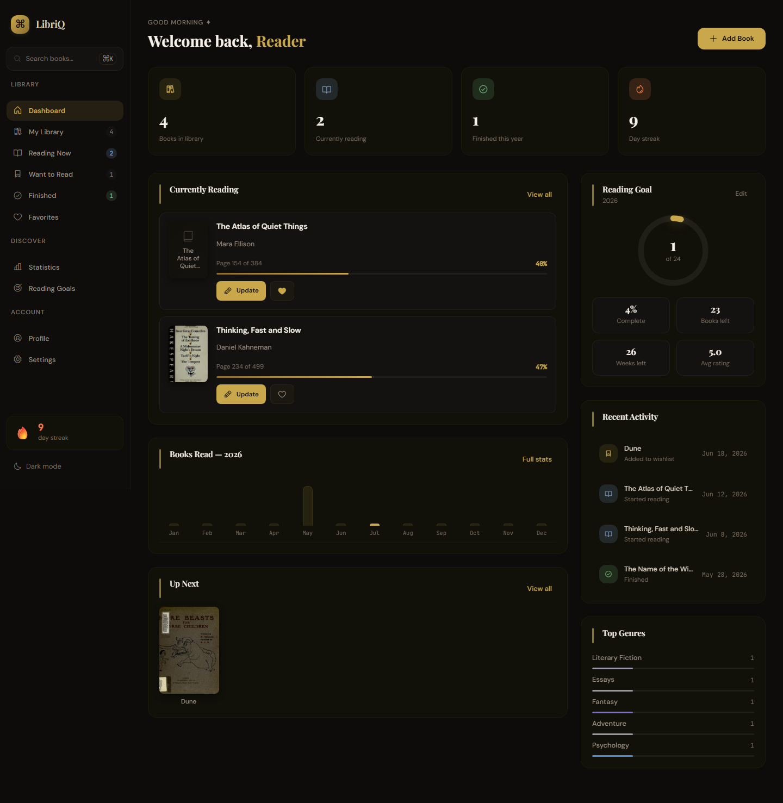
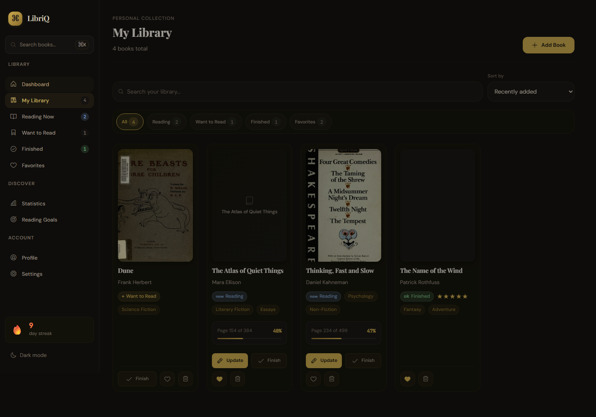
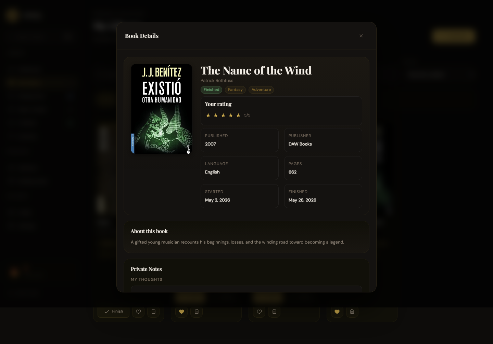
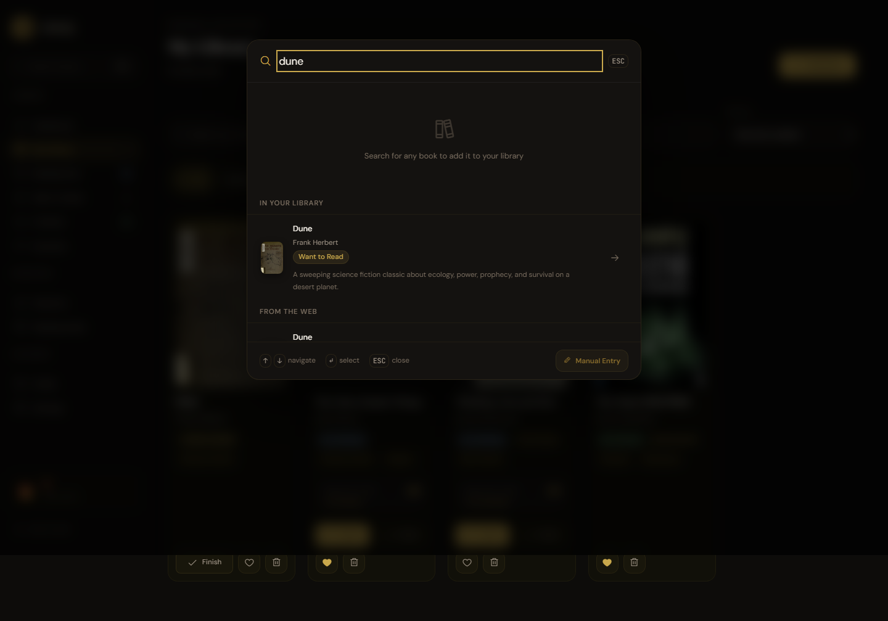
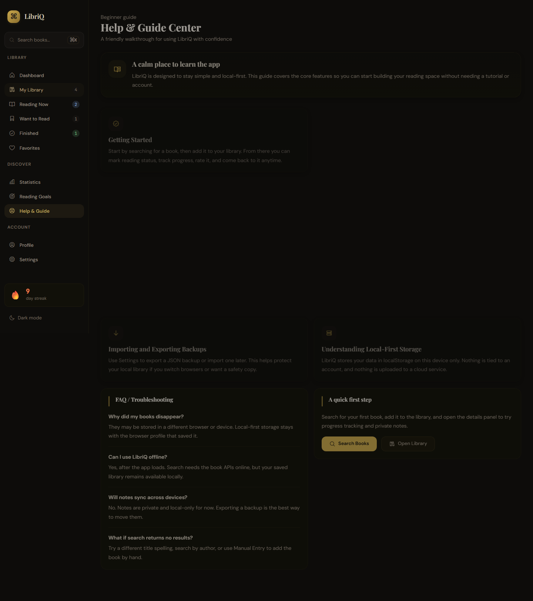
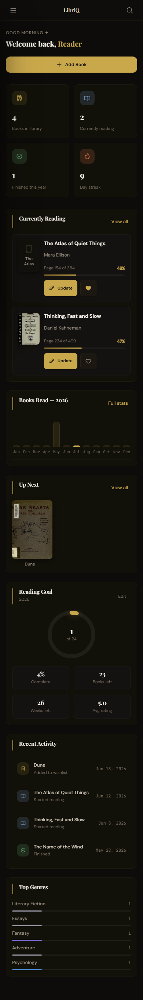

# LibriQ

**LibriQ** is a personal book-tracking web app designed to help readers organize their library, track reading progress, rate books, save favorites, write private notes, refresh book metadata, and view reading statistics in one calm and focused workspace.

The app is built with **HTML, CSS, and Vanilla JavaScript**, with book data powered by **Open Library** and **Google Books**.

LibriQ is currently focused on being a polished local-first reading tracker. Saved library data, reading progress, ratings, favorites, and private notes are stored in the browser using `localStorage`.

---

## Overview

LibriQ helps users manage their personal reading life through a simple and organized interface.

With LibriQ, users can:

* Search for books online
* Add books to a personal library
* Enter books manually when a search match is not available
* Search and sort the saved library
* Organize books by reading status
* Track reading progress by page
* Mark books as finished
* Favorite and unfavorite books
* Rate books
* Write private notes for each saved book
* View detailed book information
* Refresh missing book metadata
* View reading statistics and progress summaries
* Export and import local library backups
* Open the Help & Guide Center for app walkthroughs
* Refine online searches with advanced filters
* Discover local recommendations from saved library data
* Read update highlights in the What's New modal
* Use the PWA shell and app icons for offline-friendly access

The app is designed to feel like a focused digital reading space instead of a plain spreadsheet-style tracker.

---

## Screenshots

### Dashboard

An at-a-glance home view with reading progress, goal tracking, and recent activity.

### Library

A cover-forward shelf for browsing saved books, filters, and library search.

### Book Details

The book detail modal for progress, rating, notes, favorites, and metadata.

### Search

The search experience for finding books online before adding them locally.

### Help & Guide

A built-in guide for getting started, using backups, and learning key features.

### Mobile View

A compact mobile layout that keeps the dashboard easy to scan on smaller screens.

---

## Features

### Book Search

LibriQ uses both **Open Library** and **Google Books** to search for book data.

Search features include:

* Search modal
* `Ctrl / Cmd + K` shortcut
* Results from multiple book APIs
* Merged and deduplicated search results
* Book covers, authors, page counts, genres, and descriptions when available
* Add-to-library action from search results
* Fallback handling when one source has limited data

### Manual Book Entry

LibriQ includes a manual entry flow for books that are not found through the online APIs.

Manual entry supports:

* Required title and author fields
* Optional cover, page count, genre, description, year, publisher, language, and reading status fields
* Local-only saving with the same library actions as API-added books

---

### Library Search & Sorting

The saved library includes its own search and sorting tools.

Library search and sorting includes:

* Search by title, author, genre, status, and other saved metadata
* Sorting by multiple saved-library fields
* Fast filtering that stays fully local and works offline

---

### Import / Export Backup

LibriQ includes local JSON import and export for backups.

Backup features include:

* Exporting the full local library backup
* Importing a JSON backup with validation
* Replace or merge import flow
* Backups that stay on the user's device

---

### Help & Guide Center

LibriQ includes a built-in Help & Guide Center for onboarding and support.

The guide includes:

* Getting started help
* Search guidance
* Manual entry guidance
* Library management tips
* Progress and notes walkthroughs
* Backup guidance
* Local-first storage explanations

---

### Advanced Search Filters

The search modal includes optional filters for refining online results.

Filters include:

* Author
* Published year
* Genre or subject
* Source
* Has description
* Has cover

---

### Local Recommendations

LibriQ includes recommendations based on the user's saved library.

Recommendations are derived locally from:

* Favorites
* Genres
* Ratings
* Reading status
* Saved reading patterns

---

### What's New Modal

LibriQ includes a local What's New modal for version highlights.

It shows:

* Recent feature summaries
* Dismissed-version tracking
* A lightweight release-notes experience that stays fully local

---

### PWA and Icons

LibriQ includes PWA-ready icon and manifest support.

This includes:

* Browser favicon assets
* App icon assets
* Apple touch icon support
* Maskable icon support
* Installed app shortcut icon sizes
* A service-worker-backed offline shell for the app interface

The offline shell is intended to keep the app usable locally while still requiring internet access for live Open Library and Google Books search.

---

### Personal Library

The Library page displays saved books in a cover-forward layout.

Books can be filtered by:

* All
* Reading
* Want to Read
* Finished
* Favorites

Each saved book can include:

* Cover image
* Title and author
* Genres or categories
* Reading status
* Current page
* Page count
* Progress percentage
* Favorite state
* Rating
* Private notes
* Description or synopsis when available

---

### Book Details

Each saved book has a detailed view for managing reading progress, personal notes, and metadata.

The Book Details view includes:

* Book cover
* Title and author
* Status and genre badges
* Rating control
* Reading progress section
* Current page tracking
* Mark finished action
* Private Notes section
* Save and clear note actions
* Last updated timestamp for notes
* Favorite/unfavorite action
* Remove book action
* "About this book" section
* Refresh metadata action

If a book does not have a synopsis from the available sources, LibriQ shows:

> No description available yet.

The metadata refresh action can attempt to fill missing details such as synopsis, publisher, page count, cover, language, and genres without overwriting personal reading data like progress, status, rating, favorite state, or private notes.

---

### Private Notes

LibriQ includes local-only private notes for saved books.

Users can:

* Write personal thoughts for each book
* Save notes from the Book Details modal
* Edit existing notes
* Clear saved notes
* See when a note was last updated

Private notes are stored locally in the browser using `localStorage`. They are not public, not synced to an account, and not sent to a backend.

---

### Dashboard

The Dashboard gives a quick overview of the user's current reading activity.

It includes:

* Total books
* Currently reading count
* Finished books
* Reading streak
* Currently reading section
* Reading goal progress
* Recent activity
* Quick access to book details and progress updates

---

### Statistics

The Statistics page summarizes reading activity and saved library data.

Current statistics include:

* Total books
* Books finished
* Pages read
* Average rating
* Reading streak
* Books per month
* Pages per month
* Genre breakdown
* Highest-rated books
* All-time reading summary

Statistics are generated from the books saved in the user's local library.

---

### Reading Goals

LibriQ includes reading goal tracking to help users monitor progress toward a yearly reading target.

The reading goal view can show:

* Current reading goal
* Books completed
* Books remaining
* Completion percentage
* Goal progress visualization

---

### Theme and Responsive Design

LibriQ supports both dark and light themes, while the main visual direction is optimized around a warm dark interface.

The app is responsive across:

* Desktop
* Tablet
* Mobile screens

The interface includes mobile-friendly spacing, touch targets, cards, modals, and layouts.

---

## Design Direction

LibriQ uses a calm, reading-first visual direction.

The design focuses on:

* Warm dark surfaces
* Gold accent colors
* Elegant serif headings
* Clean sans-serif interface text
* Cover-forward book cards
* Soft borders and subtle shadows
* Clear reading progress visuals
* Mobile-friendly spacing
* Improved contrast and focus states

---

## Branding & Icon System

LibriQ uses a custom bookmark-inspired "Q" icon designed in Figma. The mark connects the app name with reading, saving books, and keeping a personal library.

The icon system includes:

* Browser favicon assets
* App icon assets
* Apple touch icon
* PWA-ready icon sizes
* Maskable icon support for installable app shortcuts

The visual direction uses:

* A warm gold mark
* A deep brown / black background
* A look that stays consistent with LibriQ's calm reading-first interface

---

## How LibriQ Works

LibriQ is a frontend-only web app.

It uses:

* **HTML** for structure
* **CSS** for layout, styling, themes, and responsive design
* **Vanilla JavaScript** for app logic and interactions
* **Open Library API** for book search data
* **Google Books API** for additional book metadata
* **localStorage** for saving the user's personal library
* **Custom Figma-designed icon assets** for the favicon, app icon, and PWA manifest

Because the app stores data locally, saved books, notes, ratings, and progress are tied to the browser being used.

---

## Data Stored Locally

LibriQ can save the following information for each book:

* Book ID
* Title
* Author
* Cover image
* Page count
* Current page
* Reading status
* Favorite state
* Rating
* Private notes
* Notes last updated date
* Description
* Genres
* Publisher
* Published year
* Language
* Date added
* Date started
* Date finished

This allows the app to preserve reading progress, ratings, private notes, and personal book state between sessions.

---

## Project Structure

```text
LibriQ/
|-- frontend/
|   |-- assets/
|   |   `-- icons/
|   |-- css/
|   |-- js/
|   |-- index.html
|   `-- manifest.json
|-- docs/
|   `-- screenshots/
|-- scripts/
|-- package.json
|-- package-lock.json
|-- README.md
`-- LICENSE
```

---

## Current Status

LibriQ is still in active development.

The current version focuses on improving the core local-first reading tracker experience, including library management, book search, reading progress, book details, ratings, private notes, metadata, statistics, responsive design, search filtering, local recommendations, backups, help content, and the PWA offline shell.

---

## Patch Notes

This section tracks notable LibriQ updates. New version logs can be added here as the project grows.

### v2.12.0 - Project Showcase & Screenshots

**Added**

* README screenshot showcase for the project
* Labeled screenshots for Dashboard, Library, Book Details, Search, Help, and mobile viewing

**Changed**

* Documentation is easier to browse thanks to a concise visual section

**Notes**

* This update does not change user data or localStorage behavior
* Screenshot automation remains unchanged

### v2.11.0 - Reading Activity History

**Added**

* Local reading activity history stored in `libriq_activity`
* Activity page with date grouping and filters for books, progress, notes, backups, and metadata
* Recent Activity dashboard feed powered by the activity log
* Activity history included in local JSON backups

**Changed**

* Recent dashboard activity now prefers the saved activity log and falls back to derived book dates when the log is empty
* Backup import now restores activity history on replace and safely merges activity on merge imports

**Notes**

* Activity data stays local in the browser and is capped to the latest 500 events
* Older backups without activity still import normally

### v2.10.1 - Offline Search State Polish

**Added**

* Clearer offline search messaging when the app is offline
* Search UI state handling that avoids stale offline banners
* Clear labeling for cached offline web results

**Changed**

* Online web search is now blocked while `navigator.onLine` reports offline status
* Fresh online results now restore the normal `From the web` label
* Offline search no longer implies a fresh fetch when the browser is disconnected

**Notes**

* Saved library features remain fully usable offline
* Online Open Library and Google Books search still requires internet access

### v2.10.0 - PWA Offline Shell

**Added**

* PWA-friendly offline app shell support
* Finalized LibriQ favicon and app icon assets
* Manifest support for installable app behavior
* App shell caching for local access to the interface
* Offline access to the saved local library

**Changed**

* The app shell is designed to stay available even when network access is unavailable
* Live Open Library and Google Books search remains network-dependent

**Notes**

* The offline shell is intended for local app access, not offline web search
* Saved books, notes, ratings, progress, and local search continue to work without internet

### v2.9.0 - What's New Modal

**Added**

* Local-only What's New modal that appears after updating to a newer LibriQ version
* Dismissed-version tracking in `libriq_seen_version`
* Friendly release notes summary for the latest local-first improvements

**Changed**

* The app now shows a simple release notes popup only when the current version has not been dismissed yet
* The modal can be closed with the button or Escape without affecting saved library data

**Notes**

* This feature stays fully local and does not send any data anywhere
* Existing book data, import/export, search, Help, and recommendations are unchanged

### v2.8.0 - Local Recommendations

**Added**

* Recommendations page in the app navigation
* Local suggestion groups based on saved library signals like favorite genres, authors, ratings, favorites, currently reading mood, and Want to Read shelf
* Recommendation cards with cover, title, author, reason label, and saved status

**Changed**

* Recommendations are generated fully from the user's local library data
* Saved recommendation cards open the existing Book Details modal

**Notes**

* No backend, analytics, cloud sync, or generated book data were added
* Import/export, manual entry, search, Help, and existing library behavior remain unchanged

### v2.7.0 - Advanced Search Filters

**Added**

* Compact advanced filters inside the existing search modal
* Filter controls for author, published year, genre/subject, source, has description, and has cover
* Clear/reset filters action
* Small active-filter indicator in the search UI

**Changed**

* Online search results can now be refined before adding a book to the library
* Filters work on the merged search result data already returned by Open Library and Google Books

**Notes**

* Search filters only affect online search results and do not change saved library search or sorting
* Manual entry, book details, notes, backups, and Help remain unchanged

### v2.6.0 - Help & Guide Center

**Added**

* Beginner-friendly Help & Guide Center in the app navigation
* Card-based walkthrough sections for getting started, search, manual entry, library management, progress tracking, private notes, backups, and local-first storage
* FAQ / troubleshooting section for common local-first questions
* Quick action buttons to jump back into search or the library from the guide

**Changed**

* Help content is fully local and static, matching LibriQ's frontend-only model
* The new guide uses the same calm card-based visual language as the rest of the app

**Notes**

* This feature is for product guidance only and does not add accounts, sync, or backend services
* Existing library data, notes, import/export behavior, and sorting logic are unchanged

### v2.5.0 - Library Search & Sorting

**Added**

* Saved-library search for quickly finding books in the local collection
* Sorting controls for organizing saved books by common library fields
* Local-only search and sort behavior that works without internet access

**Changed**

* Library browsing is faster for larger collections because search and sorting happen on saved local data
* Saved books can be organized without affecting online search or manual entry flows

**Notes**

* This feature does not change online book search behavior
* Library search and sorting remain fully local and independent of the Open Library and Google Books APIs

### v2.4.0 - Import / Export Backup

**Added**

* Local JSON export for the full LibriQ library backup
* Local JSON import with validation before any data is applied
* Replace or merge import flow for restoring backups safely

**Changed**

* Exported backups now include books plus relevant local data such as profile, goals, and streak state
* Import handling preserves the local-first model and keeps API books, manual books, ratings, progress, favorites, notes, and metadata intact

**Notes**

* Backups stay on the user's device and are never uploaded anywhere
* Merge mode deduplicates by existing book ID and replace mode clearly warns before overwriting current local data

### v2.3.0 - Search Result Descriptions

**Added**

* Short description previews in book search results when synopsis data is available
* A safe fallback message for results without a description

**Changed**

* Search results now surface merged description data from Open Library and Google Books before adding a book
* Book additions continue to persist the full description into the saved local book object

**Notes**

* Descriptions are displayed as short previews only and remain part of the existing local-first data model

### v2.2.0 - Manual Book Entry

**Added**

* Manual book entry flow for books that cannot be found through Open Library or Google Books
* Manual Entry action in the search modal and no-results state
* Manual Book Entry form with required title and author fields
* Optional cover URL, page count, genre/category, description, published year, publisher, language, and reading status fields
* Reliable local-only IDs for manually created books
* `source: "manual"` metadata for manually entered books

**Changed**

* Manual books now use the same local storage model and support the same Book Details, rating, progress, favorite, remove, notes, and statistics features as API books
* Search modal now provides a more direct fallback when no API results are available

**Notes**

* Manual books remain local-first and are stored only in the browser using `localStorage`
* Existing Open Library and Google Books add flows are unchanged

### v2.1.0 - Private Notes

**Added**

* Private, local-only notes for each saved book
* Notes textarea inside the Book Details modal
* Save Note and Clear Note actions
* Last updated timestamp for saved notes
* `notes` and `notesUpdatedAt` fields in saved book data

**Changed**

* Book Details now supports personal reading thoughts without requiring a backend or account system
* Metadata refresh preserves private notes together with existing personal reading data

**Notes**

* Notes are stored through `localStorage` and remain private to the current browser/device
* This update moves LibriQ closer to a personal reading journal while keeping the app local-first

### v2.0.0 - Core Reading Tracker Update

**Added / Improved**

* Updated LibriQ branding
* Book search using Open Library and Google Books
* Merged and deduplicated search results
* Personal library with status filters
* Book Details modal with rating, progress, favorite, remove, and metadata refresh actions
* Statistics page with reading summaries
* Responsive desktop and mobile design
* Light and dark theme support
* Deployment cleanup for Vercel
* README rewritten as a project overview and guide

**Notes**

* This version established LibriQ as a stable local-first personal book tracker and the foundation for future product updates

---

## Possible Future Improvements

Future improvements may include:

* Better metadata matching
* Reading activity history
* Activity heatmap
* Better mobile navigation
* PWA and offline enhancements if full offline behavior still needs polish
* Optional backend and cloud sync
* User profiles and social reading features

Backend, accounts, cloud sync, and social features are intentionally treated as later-stage improvements because they require more careful planning around authentication, privacy, data storage, and user security.

---

## Notes

Some books may not show a full description because not all book data sources provide synopsis data for every result. When a description is unavailable, LibriQ displays a safe fallback instead of generating or inventing one.

Some external cover images may also fail to load if blocked by browser extensions or if the source does not provide a valid image.

Since LibriQ currently stores data locally, clearing browser data or using a different browser/device may remove or hide saved library data. Import/export is already implemented for local backups, and cloud sync remains a future possibility if you want cross-device access later.
