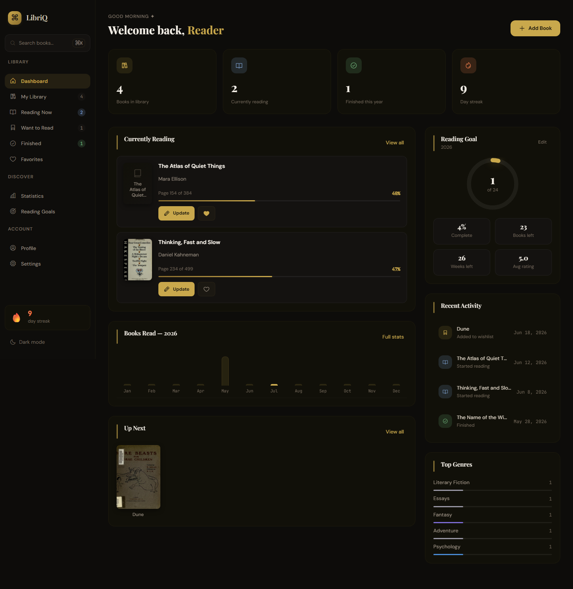
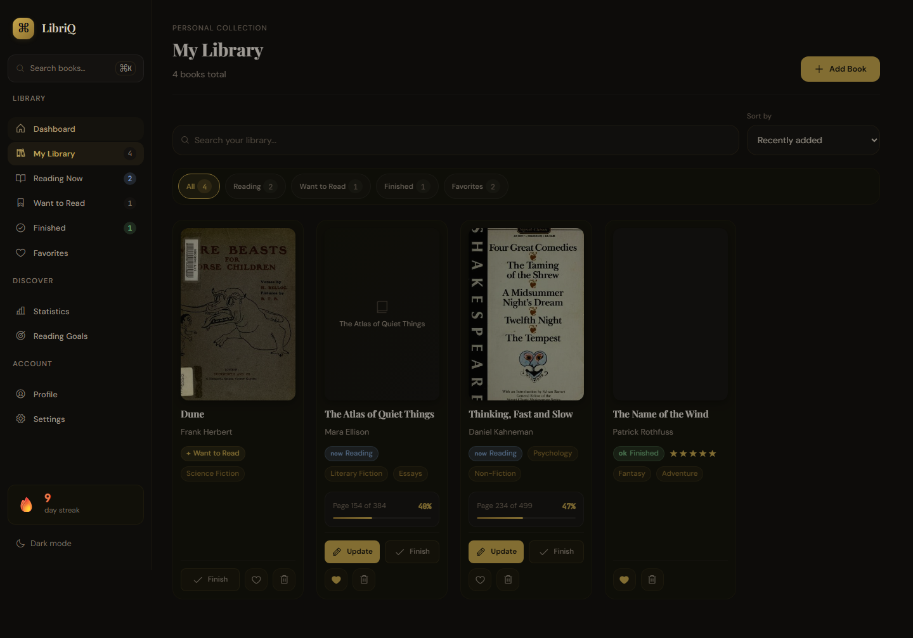
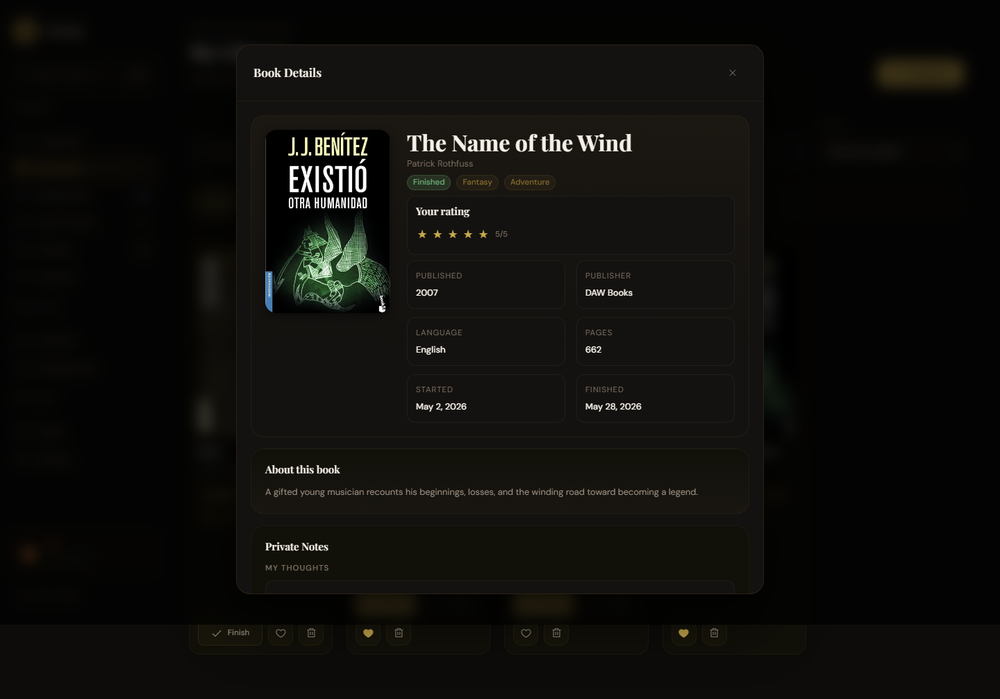
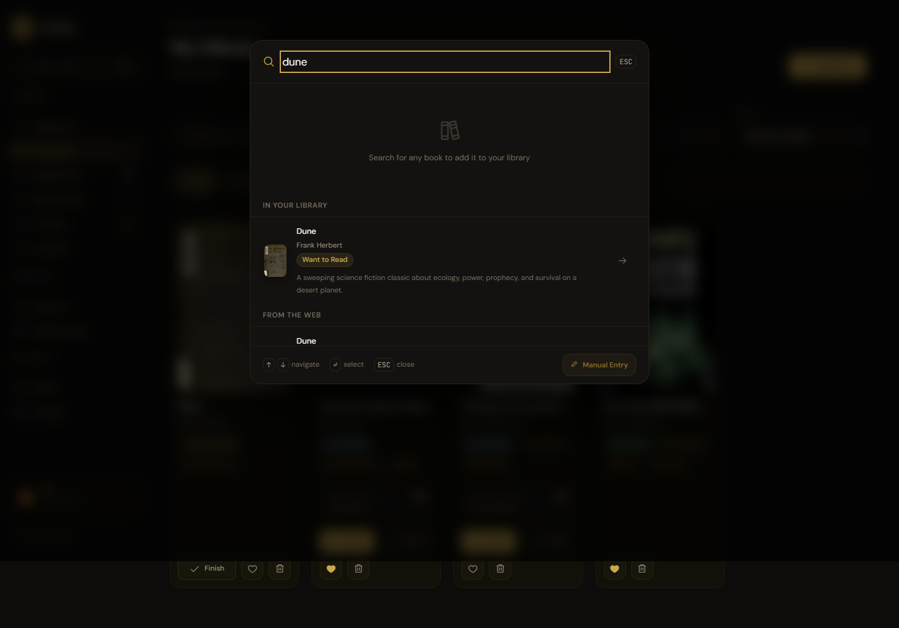
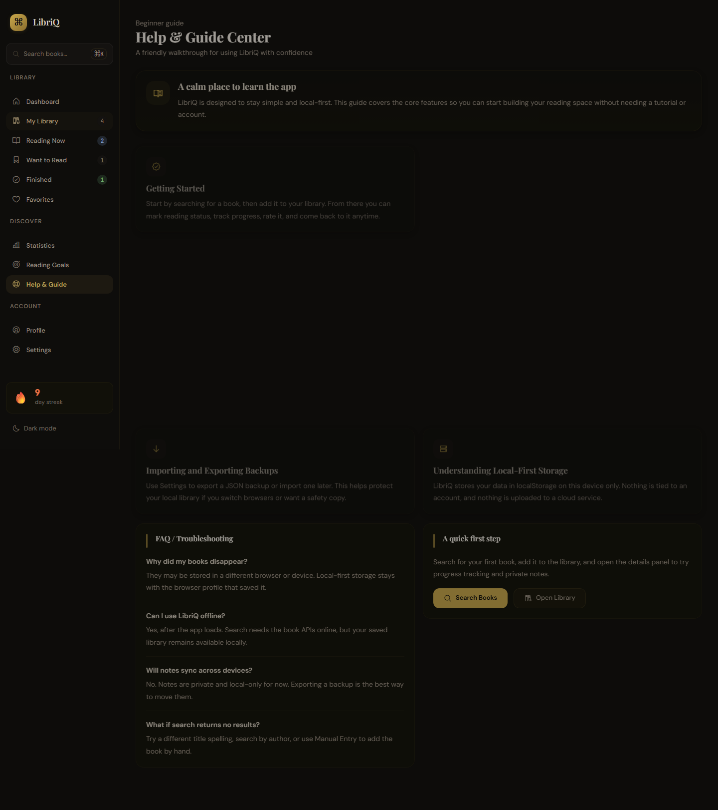
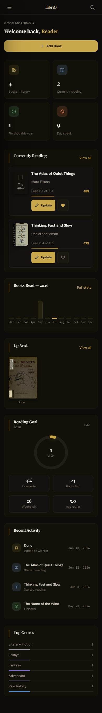

# LibriQ

**LibriQ** is a cloud-first personal book-tracking web app for organizing a personal library, tracking reading progress, rating books, saving favorites, writing private notes, refreshing metadata, and reviewing reading statistics in a calm, focused workspace.

The app is built with HTML, CSS, and Vanilla JavaScript. Book metadata comes primarily from Google Books and Open Library, with additional discovery and readable-link integrations from Gutendex / Project Gutenberg and Internet Archive.

LibriQ centers on signed-in account use through Google or email/password authentication. When account services are unavailable, an offline fallback can keep the app usable on the current device. Local JSON backups, manual cloud backup and restore, cloud merge previews, automatic Account Sync, and Sync Health diagnostics provide several layers of data safety.

LibriQ 4.7 retains the v4.6 metadata and discovery improvements while adding synced activity history, clickable library-based recommendations, and smoother session restoration. Basic Google Analytics page-view tracking is used only for anonymous traffic measurement.

## Documentation

- [Architecture](docs/ARCHITECTURE.md)
- [Changelog and patch notes](docs/CHANGELOG.md)
- [User guide](docs/USER_GUIDE.md)
- [Firebase, authentication, sync, and backup](docs/FIREBASE.md)
- [Deployment and environment configuration](docs/DEPLOYMENT.md)
- [Book APIs and providers](docs/API.md)

## Key Features

- Search Google Books and Open Library with merged, deduplicated results
- Add API results or enter books manually
- Organize books by reading status, favorites, custom shelves, and metadata quality
- Search, filter, and sort the saved library locally
- Track pages, completion, ratings, private notes, and private quotes
- Refresh missing metadata without overwriting personal reading data
- Review Dashboard summaries, Statistics, yearly recap, goals, streaks, and activity
- Discover local recommendations based on saved-library signals
- Browse Open Library subject rails and free classics from Gutendex
- Open Internet Archive readable or archive links when available
- Export, validate, merge, replace, and restore JSON backups
- Use Firestore cloud backup, manual restore and merge, and automatic Account Sync
- Diagnose account and sync readiness from Settings
- Use responsive light and dark themes and an offline-friendly PWA shell
- Learn the product through the built-in Help & Guide Center and What’s New modal

For complete workflows and field-level details, see the [User Guide](docs/USER_GUIDE.md).

## Screenshots

### Dashboard



An at-a-glance home view with reading progress, goal tracking, and recent activity.

### Library



A cover-forward shelf for browsing saved books, filters, and library search.

### Book Details



The book detail modal for progress, rating, notes, favorites, and metadata.

### Search



The search experience for finding books online before adding them locally.

### Help & Guide



A built-in guide for getting started, using backups, and learning key features.

### Mobile View



A compact mobile layout that keeps the dashboard easy to scan on smaller screens.

## Tech Stack

- **HTML** for structure
- **CSS** for layout, themes, responsive design, and the Studio visual system
- **Vanilla JavaScript** for application logic and interactions
- **Firebase Authentication** for Google and email/password accounts
- **Cloud Firestore** for account sync, activity history, and cloud backups
- **localStorage** for device-local library and reading state
- **Google Books API** and **Open Library API** for primary metadata search
- **Gutendex / Project Gutenberg** for free-classics discovery
- **Internet Archive** for readable and archive links
- **Web App Manifest and service worker** for installable, offline-friendly access
- **Figma-designed assets** for the LibriQ icon and branding system

Saved books, progress, ratings, favorites, notes, and other reading state remain available locally in the browser. Account Sync and cloud backup are separate account-backed safety features. See [Firebase](docs/FIREBASE.md) for the exact boundaries.

## Quick Start

Requirements:

- Node.js and npm
- A local static-file server
- Optional Firebase and Google Books credentials for account and keyed-search testing

```bash
git clone https://github.com/AK-Lmn/Libriq.git
cd Libriq
npm install
npm run build
```

Serve the repository and open:

```text
http://localhost:5500/frontend/index.html
```

Normal public book search does not require local configuration. To enable Firebase sign-in locally, create a root `.env`, run `npm run build`, and add `localhost` to Firebase Authentication’s authorized domains. Use `localhost`, not `127.0.0.1`, for Firebase sign-in testing.

See [Deployment](docs/DEPLOYMENT.md) for the complete environment-variable list, generated configuration behavior, Vercel settings, and deployment notes.

## Project Structure

```text
LibriQ/
|-- frontend/
|   |-- assets/
|   |   `-- icons/
|   |-- css/
|   |-- js/
|   |   |-- app/
|   |   |-- features/
|   |   `-- services/
|   |-- index.html
|   `-- manifest.json
|-- docs/
|   |-- screenshots/
|   |-- API.md
|   |-- ARCHITECTURE.md
|   |-- CHANGELOG.md
|   |-- DEPLOYMENT.md
|   |-- FIREBASE.md
|   `-- USER_GUIDE.md
|-- scripts/
|-- package.json
|-- package-lock.json
|-- README.md
`-- LICENSE
```

The application uses native ES modules and feature/service boundaries while keeping `navigation.js` as the primary composition root. See [Architecture](docs/ARCHITECTURE.md) for the API boundary and temporary classic-script bridge.

## Current Status

LibriQ is in active development. The current release focuses on a stable reading tracker with library management, online and manual book entry, progress, ratings, private notes and quotes, metadata enrichment, statistics, responsive design, recommendations, backups, authenticated cloud sync, activity history, and an offline-friendly PWA shell.

Current limitations and considerations:

- Live metadata search requires an internet connection.
- Some providers do not return a synopsis or valid cover for every book; LibriQ displays safe fallbacks rather than inventing missing data.
- Device-local data can be hidden or removed by clearing browser data or changing browsers unless it has been exported, backed up, or synced.
- Account, backup, restore, merge, and sync behavior is documented separately because each has different data-safety semantics.

Possible future improvements include better metadata matching, an activity heatmap, further mobile-navigation polish, further PWA/offline polish, and carefully designed profile or social-reading features. Earlier roadmap notes also considered activity history, optional backend storage, and cloud sync; several of those capabilities have since shipped. Authentication, privacy, storage, and user security remain the deciding constraints for future account-backed or social work.

## License

This project is licensed under the terms in [LICENSE](LICENSE).
